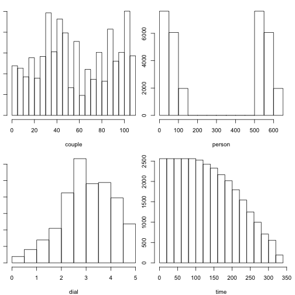
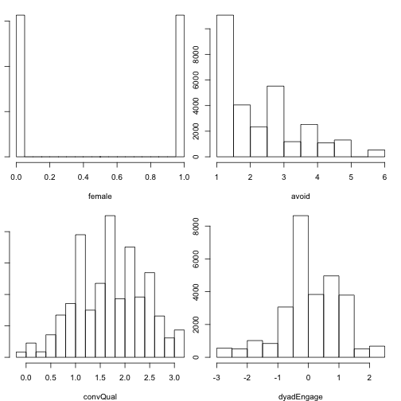
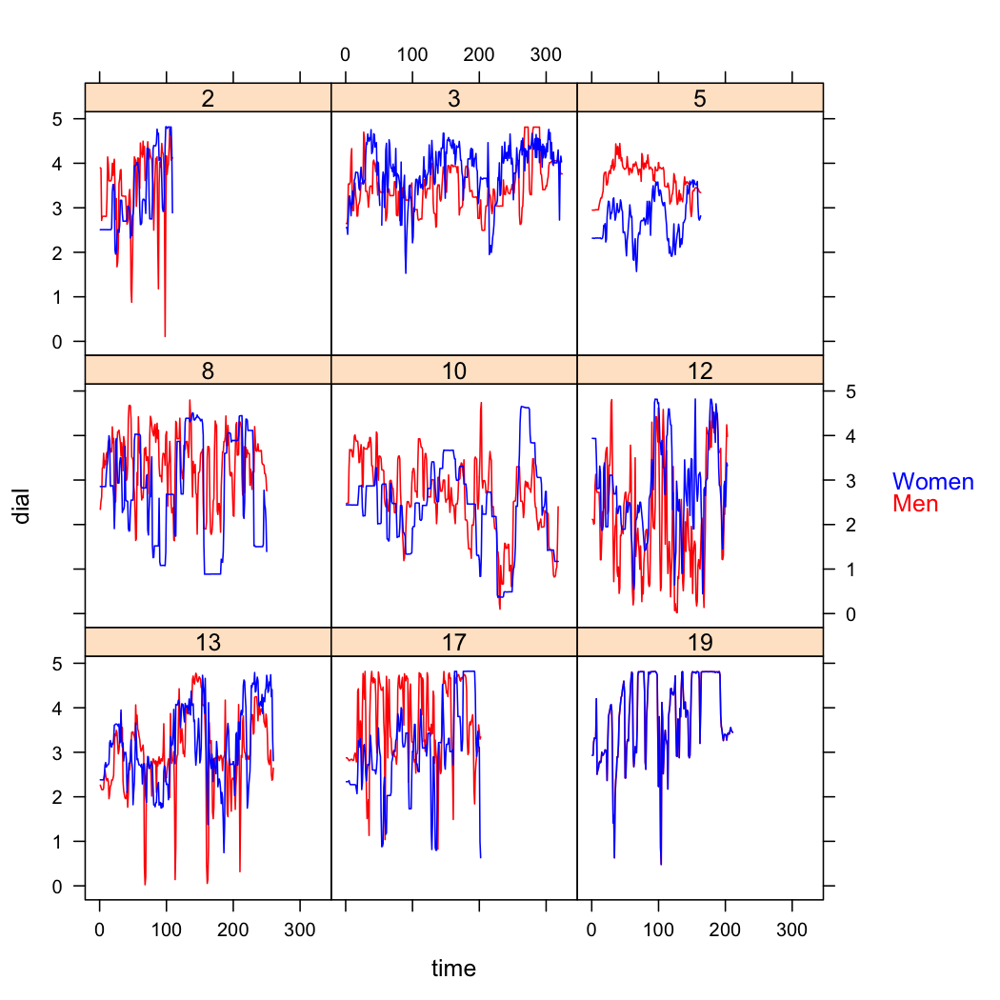

The _rties_ package streamlines and simplifies testing whether a set of bivariate temporal patterns either predict, or are predicted by, global variables of interest. Although we focus on time-series data from both people in dyads, the models are appropriate for any bivariate normal time-series data (e.g., heart rate and skin conductance from one person over time). The analysis starts with an observed variable that is assumed to be a valid indicator of some underlying phenomenon (e.g., emotion), assessed repeatedly over time for both partners in a sample of dyads. We provide a set of models that represent different aspects of the bivariate dynamics of the observed variable (note, the observed variable must be roughly normally distributed). The parameter estimates from those models are then used as input variables for a latent profile analysis and the predicted profile membership for each dyad is used either to predict, or be predicted by, cross-sectional variables of interest (e.g., each person’s global health). Currently the package includes two models: 1) the “Inertia-Coordination” model, which can represent within-person inertia and between-person in-phase or anti-phase coordination (Figure 1), and 2) a “Coupled-Oscillator” model, which can represent between-person damping (a.k.a. coregulation) and amplification (a.k.a. co-dysregulation) of coupled oscillations (Figure 2).
```
Figure 1: Patterns represented by the Inertia-Coordination model. The y-axis represents whatever the bivariate time-series variable is. Panel A shows low and high inertia. Panel B shows in-phase coordination. Panel C shows anti-phase coordination.
```
  
```
Figure 2: Patterns represented by the Coupled-Oscillator model. The y-axis represents whatever the bivariate time-series variable is. Panel A shows between-person damping of oscillations (a.k.a. coregulation). Panel B shows between-person amplification of oscillations (a.k.a. co-dysregulation).
```
  


## General Procedure

The first step in our method is to choose the observed variable, which must take the form of a bivariate normal time-series. In the language of dynamic systems, the pair of observed responses are indicative of the underlying (latent) states of the system across time. In _rties_ we refer to the two time-series of observed responses as the “state” variables, and seek to represent their dynamics with a mathematical model. The temporal unit of observation (e.g., seconds, minutes, days), minimum number of observations per dyad and minimum number of dyads required for these analyses depend on theory about the process of interest, in combination with the model chosen. More information is given in the documentation for each model.   

The second step is to choose which of the model(s) include parameters representing relevant aspects of the system that you think characterizes the observed state variables. For example, imagine a very simple model that only has intercepts and linear slopes for each partner (e.g., we theorize that the system can be characterized by two independent lines, which is clearly over-simplified and not “interpersonal” at all, but useful for understanding our general approach). We then estimate the parameters for that model separately for each dyad. In our example, we would use our data to estimate the 4 parameters of the model (2 intercepts and 2 slopes) for each dyad.  

In the third step we use the set of parameter estimates (e.g., each dyad’s intercept and slope estimates) as input variables for a latent profile analysis. In the fourth and final step, the resulting predicted profile memberships are then used either as predictors, or outcomes, of some variable of interest across all dyads. We refer to these global variables as “system” variables because they are theoretically related to the system being studied, but change slower than the state variables used to assess the dynamics of the system (for examples of other research groups using similar approaches see: Felmlee, 2007; Ferrer, Chen, Chow, & Hsieh, 2010; Ferrer & Steele, 2014; Hollenstein, 2013; Steele, Ferrer, & Nesselroade, 2014; Steenbeek & van Geert, 2005). The system variable can be assessed at either the dyad level (e.g., both partners have the same score, such as relationship length) or the individual level (e.g., the partners can have different scores, as in a personality measure).

## Getting Started

To get started, install _rties_ from GitHub (it is not yet available on CRAN) and load it in R.

```r
devtools::install_github("ebmtnprof/rties")
#> Skipping install of 'rties' from a github remote, the SHA1 (f2c50153) has not changed since last install.
#>   Use `force = TRUE` to force installation
library(rties)
```

You can then assign the example data to a dataframe and list the contents.

```r
data1 <- rties_ExampleData_2
str(data1)
#> 'data.frame':	31308 obs. of  8 variables:
#>  $ couple    : int  2 2 2 2 2 2 2 2 2 2 ...
#>  $ person    : int  2 2 2 2 2 2 2 2 2 2 ...
#>  $ dial      : num  2.51 2.51 2.51 2.51 2.51 ...
#>  $ time      : int  1 2 3 4 5 6 7 8 9 10 ...
#>  $ female    : int  1 1 1 1 1 1 1 1 1 1 ...
#>  $ avoid     : num  1 1 1 1 1 1 1 1 1 1 ...
#>  $ convQual  : num  0.983 0.983 0.983 0.983 0.983 ...
#>  $ dyadEngage: num  -0.5 -0.5 -0.5 -0.5 -0.5 -0.5 -0.5 -0.5 -0.5 -0.5 ...
```
This dataframe provides an example of an appropriate input data file for _rties_. The variables “couple” and ”person” are identification variables for the dyads and individuals within dyads respectively.The variable called “dial” is the state variable, which in this example is the emotional experience of romantic partners, self-reported in 4 second units using a rating dial following a conversation while watching the video of their conversation as a memory prompt. The variable “time” indicates the temporal sequence of the observations. The variable “female” is a numeric variable, scored as zero or one, which distinguishes between the types of partners, which in our example are females (scored 1) and males (scored 0).The variables called "avoid", “convQual”, and "dyadEngage" are system variables to be predicted from (or used to predict) the dynamics of the partner's emotional experience. In this example, they are self-reports following the conversation obtained from both partners. "Avoid" is an individual level self-report of trying to avoid emotion during the conversation; "convQual" is also an individual level self-report of positive conversation quality (high feelings of closeness, positive emotion, emotional acceptance and empathy); "dyadEngage" is a dyad-level self-report of feeling engaged in the conversation (e.g., it is the dyad's average report of feeling engaged). 

## Data Visualization and Preparation

The _rties_ package includes functions to do all the data processing necessary for any of the models, but you must provide it with a dataframe, similar to the example data provided above, that meets a number of criteria. The dataframe must include: 1) a person-level ID, 2) a dyad-level ID, 3) a time-varying observable (the state variable), 4) a time-constant system variable, e.g., something that will be either predicted from, or act as a predictor of, the dynamics of the observed state variables, 5) a variable that distinguishes the partners (e.g., sex, mother/daughter, etc) that is numeric and scored 0/1, and 6) a variable that indicates sequential temporal observations (e.g., time). The system variable must be cross-sectional, but can be measured at either the individual or the dyad level. In our example, we have two at the individual level (avoid and convQual) and one at the dyad-level (dyadEngage). The partners within each dyad must have the same number of observations (e.g. rows of data), although those can include rows that have missing values (NAs). Each dyad, however, can have it's own unique number of observations.    

__Important__: The dyad ID and person ID must be the same for the level-0 partner (e.g., the partner who is scored zero on the distinguishing variable). Then you must choose a large number to add to the level-0 person ID to get the level-1 person ID. For example, if you have 200 couples, you might choose 500 as the value to add. Then if the dyad ID and level-0 person IDs for 4 participants were 1, 3, 4, 7 the level-1 partners would be 501, 503, 504, 507 (see example data for what this should look like). Some functions will need the number you added as an argument called “idConvention”.       

Bivariate dynamic models are complex and there are a lot of ways to fool yourself about the quality and interpretation of the results. To help prevent this, we strongly advocate looking at your data and results at every step of the analysis and we provide visualization tools to make it easy. As an initial check, we recommend looking at histograms of all of the numeric variables in your dataframe. This should uncover any seriously ill-behaved data (extreme outliers, zero variance, etc). In addition, if you intend to use the system variable as an outcome of the dynamics, you will need to decide whether it is fairly normally distributed and the default gaussian model is appropriate, or whether you will need to use one of the generalized linear model options (e.g., binomial, gamma, exponential, etc). The following function produces histograms for all numeric variables in a dataframe:


```r
histAll(data1)
```



A second highly recommended check is to plot the raw time-series data for each dyad, which can be accomplished with the “plotRaw” function. If you have a large number of dyads, you may want to consider only plotting a random subset, or several random subsets (for this vignette we plot a specific sub-set to present some typical-looking examples). The function takes as arguments the name of your dataframe (or a temporary one containing the sub-set of dyads to be plotted), the dyad ID, the state variable, the distinguishing variable, and the variable that indicates sequential temporal observations. It also takes optional strings for the labels of the levels of the distinguishing variable in the correct order (e.g., a name for level-0 first, in this case "Men", then a name for level-1, in this case "Women"). Running the following code we see that one person is completely missing data for dyad 19, which will cause problems if we don't fix it (if you are not plotting all your dyads, you will need to use some other method to identify any dyads with completely missing data for one or both partners). This visualization is also useful for spotting outliers, noise in the data, etc.

```r
temp <- subset(data1, couple %in% c(2,3,5,8,10,12,13,17,19))
plotRaw(temp, "couple", "dial", "female", "time", "Men", "Women")
```



At this point, it would be worthwhile to see if the missing data can be accounted for. In our case, we discovered there had been recording problems for the one person and so the only thing we can do about the missing data for dyad 19 is to remove that dyad from the analysis (several steps in the modeling require at least partial data from both partners and will generate error messages if that is violated). The following syntax accomplishes that. First, the dyad to remove is assigned to a variable called "dyads" (if more than one dyad is to be removed, this could be a vector, e.g., dyads <- c(3, 5, 19) would remove three dyads). Then the "removeDyads" function takes as arguments the full dataframe, the variable indicating which dyads to remove, and the name of the dataframe column that includes dyad membership.

```r
dyads <- c(19)
data2 <- removeDyads(data1, dyads, data1$couple)
```
The “dataPrep” function does all the work of processing the data into a generic form that is appropriate for any of the _rties_ models. Function arguments are: basedata (the cleaned up dataframe; “data2” in this example), id (the person ID), dyad (the dyad ID), obs (the observed state variable), sysVar (the cross- sectional system variable), dist (the distinguishing variable), time_name (the variable indicating temporal sequence), and time_lag (an optional argument for the number of lags to use for the lagged observable).The function returns a dataframe that has all the variables needed for TIES modeling, each renamed to a generic variable name, which are:   

* id = person id
* dyad = dyad id
* obs = observed state variable
* sysVar = system variable
* dist1 = 0/1 variable where the 1's indicate the 1's in the original distinguishing variable
* dist0 = 0/1 variable where the 1's indicate the 0's in the original distinguishing variable
* time = the variable indicating temporal sequence
* obs_deTrend = the observed state variable with each person's linear trend removed
* p_ = all the same variables, but for a person's partner rather than themselves    

A note about choosing the lag: You can lag the observed variable by any number of steps and that decision should be driven by theory and prior research. In this case, emotional experience was assessed in 4 second intervals and so a 1-step lag is very small and doesn't leave time for meaningful change between observations. We chose a lag of 3 steps, which is equivalent to 12 seconds, because 10-15 seconds is a common unit to aggregate over in the emotional experience literature and if emotions unfold over several minutes (as suggested by many theories), then 10-15 second steps are large enough to allow meaningful change between each step, but small enough to not miss important changes.    

The usage of “dataPrep” follows, where “data2” is the original data set with any necessary cleaning done and “data3” will be a dataframe holding the processed data. Currently, the code is set to only consider one system variable at a time, which is included at this initial data preparation step. Here we focus on "convQual":

```r
data3 <- dataPrep(data2, "person", "couple", "dial", "convQual", "female",
 "time", time_lag=3)
```
At this point you are ready to begin using one or more of the models to test whether any of the dynamic patterns can predict, or be predicted by, your system variable(s) of interest. The procedures for each model are documented in additional vignettes.
