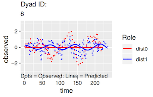
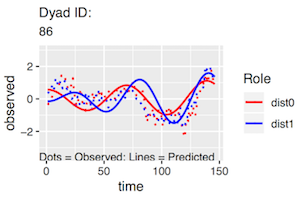
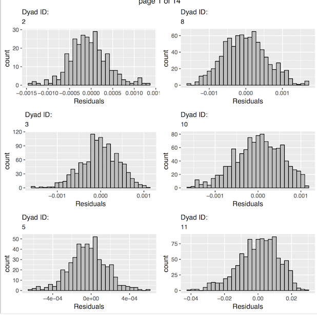
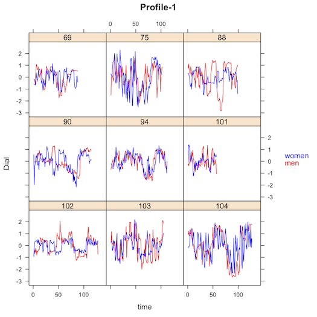
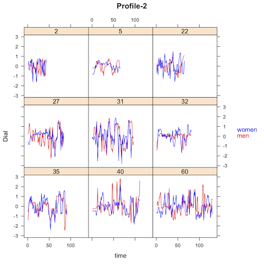

```{r setup, include = FALSE}
knitr::opts_chunk$set(
  collapse = TRUE,
  comment = "#>"
)
```

As for all _rties_ analyses, the first step for a Coupled-Oscillator analysis is to follow the instructions in “overview_data_prep” to visualize and prepare the data. We include only the minimal required steps here:

```{r}
library(rties)
data1 <- rties_ExampleDataFull
data2 <- dataPrep(basedata=data1, dyadId="couple", personId="person", obs_name="dial", 
                  dist_name="female", time_name="time") 
```

Variations on the Coupled-Oscillator model are fairly common in the literature on close relationships and emotion (Boker & Laurenceau, 2006, 2007; Butner, Diamond, & Hicks, 2007; Helm, Sbarra, & Ferrer, 2012; Reed, Barnard, & Butler, 2015; Steele & Ferrer, 2011). All the models have in common that they: 1) are based on differential equations, 2) characterize oscillatory phenomena, 3) include some form of coupling (mutual influence between partners), and 4) represent damping or amplification of the oscillations over time. The last distinction is particularly important because it is central to defining co-regulation, whereby partner’s mutual influence has a homeostatic effect, resulting in both partners returning to a stable set-point following some disruption to the system, versus co-dysregulation, whereby partner’s mutual influence results in increasingly volatile fluctuations away from a set-point (Butler & Randall, 2013; Reed et al., 2015).  This contrast is shown in Figure 2 in the "overview_data_prep"" vignette. 

One of the challenges of using COMs is that they rely on derivatives. The typical approach in social science is to estimate those derivatives from the data, which has limitations but is tractable, and this is the approach we use in _rties_ (for a discussion see Butler et al., 2017). We make use of a Local Linear Approximation suggested and implemented in R by S. Boker (Boker, Deboeck, Edler, & Keel, 2010; Boker & Nesselroade, 2002). The _rties_ version of a COM predicts the second derivative of the observed state variable from: 1) a person’s own state variable, which is related to the frequency of oscillations, 2) a person’s own first derivative of the state variable, which indicates damping/amplification, 3) a person’s partner’s state variable, which indicates coupling with respect to frequency, and 4) a person’s partner’s first derivative of the state variable, which indicates coupling with respect to damping/amplification. The model includes separate estimates for both partner types (e.g., men and women), resulting in a total of 8 parameters. The lm model used by the _rties_ functions is:

lm(d2 ~ -1 + dist0:obs_deTrend + dist0:d1 + dist0:p_obs_deTrend + dist0:p_d1 + dist1:obs_deTrend + dist1:d1 + dist1:p_obs_deTrend + dist1:p_d1, na.action=na.exclude, data=datai)

where “d2” is the second derivative of the observed state variable (the time-series emotional experience variable in our example) with linear trends removed (e.g., it is the second derivative of the residuals from each person’s state variable predicted from time) . The “-1” results in the intercept being omitted (which is part of the formulation of any Coupled-Oscillator model). The terms “dist0” and “dist1” are indicator variables, scored 0 or 1 to indicate which partner type is represented. In other words, terms multiplied by “dist0” indicate the estimate of that term for the partner scored 0 on the distinguishing variable provided by the user (see “overview_data_prep”), while terms multiplied by “dist1” indicate the estimate for the partner scored 1 on the original distinguishing variable. 

The term “obs_deTrend” is the observed state variable with individual linear trends removed. When considered in isolation, this parameter represents how quickly the observed process oscillates, but its values are not interpretable until transformed into frequency (cycles per time), or its reciprocal, period (time for one cycle). Estimates for the parameter (we will call it η here) also need to be negative in order to be interpretable. Assuming a negative estimate, η < 0, the time for one complete cycle (period) is estimated by ((2π) / (sqrt(-[η]))). Larger absolute values of η are indicative of more rapid oscillations. The term “p_obs_deTrend” is the observed state variable for a person’s partner with individual linear trends removed and, in isolation, represents coupling with respect to frequency (e.g., the impact of the partner on one’s own oscillatory frequency). The term “d1” is the first derivative of the observed state variable with linear trends removed. Negative estimates of this term represent damping, or the tendency for the state variable to converge back to homeostatic levels. Positive estimates, in contrast, represent amplification, or the tendency of the state variable to increasingly deviate away from homeostatic levels. A zero estimate suggests a continuously oscillating process of constant amplitude. Finally, the term “p_d1” is the first derivative of a person’s partner’s state variable with linear trend removed and represents coupling with respect to damping/amplification (e.g., the impact of the partner on one’s own damping/amplification). Note that we estimate this model separately for each dyad (e.g., “datai” is the data from couple “i”) and hence it is not a multilevel model.

It is important to realize that the parameters of the CLO model (or any other non-linear model) do not act in isolation - they work together as a set to determine potentially complex trajectories for both partners over time. As with any non-linear model, it is impossible to inspect the CLO parameters individually and draw any conclusions about the dynamic pattern implied without actually plotting it using the full set of parameter estimates. The _rties_ package provides a variety of functions for doing so that are described below.

### Sample Size Considerations

There are two sample size considerations for any of the models implemented in _rties_. The first pertains to the number of observations per dyad that are required, while the second is the number of dyads required. The first consideration comes into play when we estimate the dynamics one dyad at a time. Greater complexity requires finer-grained measurement of time and hence more observations per dyad. The Coupled-Oscillator model represents fairly complex dynamics and hence requires more observations per dyad than simpler models. The exact number of observations required, and the spacing between them, will depend upon the temporal processes involved, however. For a good discussion of these issues see Boker & Nesselroade, 2002. As an over-simplified summary, the goal is to have enough observations per oscillatory cycle for at least 2 cycles to be able to “see” the oscillatory pattern. For example, if there were only 2 observations per cycle, there would be no way to estimate the curvature. Or if there were only observations for one cycle, there would be no way to estimate damping/amplification across cycles. A gross guideline that has been suggested is that between 16 to 90 observations per dyad represents the minimum, but again whether this is enough to recover the “true” oscillatory dynamics is dependent on a number of assumptions (Boker & Nesselroade, 2002). A pragmatic approach is to try using a Coupled-Oscillator model and if you do not get any convergence errors or any out-of-bound estimates, and you achieve an adequate fit to the data for most dyads, you have enough observations per dyad to make progress.    

The second sample size consideration comes into play when we use latent profiles based on the estimated dynamic parameters for each dyad to either predict the system variable, or be predicted by it (these steps are described in detail in sections below). In both cases, the system variable can be either a dyadic variable (e.g., both partners have the same score, as in relationship length) or an individual variable (e.g., partners can have different scores, as in age). In the case of predicting a dyadic system variable, a regular regression model is appropriate for normally distributed system variables, or a generalized linear model for non-normal ones (any of the families available for glm can be used). In this case, the shared system variable is predicted by the categorical latent profile membership and you can use your favorite rule of thumb along the lines of “n observations for a one-predictor regression model” to choose your sample size. Alternately, you could conduct a power analysis for the linear (e.g., regular regression) or generalized linear model you choose. 

The situation is more complicated when the system variable is assessed at the individual level, or when it is the predictor of the latent profiles. In the former case, the system variable is predicted using a cross-sectional random-intercept dyadic model with the latent profile membership, the distinguisher variable and their interaction as fixed effects. For these models, it should be possible to use the R package _simr_ to estimate the necessary sample size to obtain desired power. In the latter case, profile membership is predicted using either a binomial (for 2 latent profiles) or multinomial (for more than 2 latent profiles) model, with either just the system variable as a predictor (for dyadic system variables), or each partner's system variable and their interaction as predictors (for individual system variables). For these models, it should be possible to use G-Power, or some other software for logistic and multinomial regression, to assess the needed sample size for a given power level.

### Estimating Derivatives From the Data

Having prepared the data, the next step for the Coupled-Oscillator model is to estimate first and second derivatives of the time-series state variable. As mentioned above, we use a Local Linear Approximation suggested and implemented in R by S. Boker (Boker, Deboeck, Edler, & Keel, 2010; Boker & Nesselroade, 2002). This method requires the user to provide settings for 3 control parameters: tau, embed, and delta. Tau is the number of time points to include when estimating the first derivative, which is the mean of two adjacent slopes across that number of time points on either side of time t (e.g., if tau = 2 then the estimate of the first derivative at time = t is based on the mean of the slopes left and right of time t across 2 observations each). The second derivative is the difference in the two slopes with respect to time. Tau = 1 is sensitive to noise and increasing its value acts as smoothing. Embed is relevant to the degree of derivatives that are desired and the minimum embed is 3 for 2nd order derivatives. Higher values increase smoothing. Finally, delta is the inter-observation interval and is typically set to one (e.g., if equal 2, then every second observation is used).

Choosing optimal values for tau and embed is a complex process and the resulting derivative estimates are highly sensitive to them. In _rties_ we provide the “estDerivs” function to investigate sets of tau and embed for a given delta with respect to the quality of fit for a coupled oscillator model for each dyad’s data. In other words, the user provides vectors of tau and embed values and the function fits an oscillator model to each dyads’s data using each pair of tau and embed values, and returns a list with the maximal R^2 for each dyad, the values of tau and embed that resulted in that maximal R^2, and the periods of oscillation associated with that tau/embed combination for each partner. This information can be used to adjust the set of tau and embed until the model fit is fairly good for all dyads and the range of periods of oscillation is appropriate for the process being investigated.

For example, if we expect the process we are studying to oscillate every 2-3 minutes, then we may choose values of tau and embed that result in lower overall R^2 but produce a range of periods from 1-5 minutes in preference to those that produce a higher average R^2, but a range of periods from 10-15 minutes. The reasoning here is that it is preferable to have somewhat worse measurement of the right process, than better measurement of the wrong process. Note that you may encounter a variety of error messages during the process of selecting tau and embed vectors, all of which imply an inappropriate combination of tau and embed. The solution is to change the selection of tau and embed until no errors are encountered. The following code assigns values for taus, embeds and delta and then provides those as arguments to "estDerivs". Note that the vectors for taus and embeds can be any length, but the longer they are, the longer the function will take to run. We chose these taus and embeds based on prior experimentation that showed that larger values produced inappropriate period lengths for our process of interest (e.g., the period became as long as most conversations lasted, meaning that no oscillations were predicted). The function also requires the argument "idConvention" which is the value you added to the level-1 person ID to get the level-0 person ID (see "overview_data_prep").
```{r}
taus <- c(4,5)
embeds <- c(3,4,5)
delta <- 1

derivs <- estDerivs(prepData=data2, taus=taus, embeds=embeds, delta=delta, idConvention=500)
```
The object “derivs” that was created from “estDerivs” contains a dataframe called “data” that holds the derivative estimates for each person using the tau/embed combination that maximized that dyad’s R^2. It also contains a dataframe called “fitTable” with the fit information. Here are the first 6 entries of the fitTable from our example:
```{r}
head(derivs$fitTable, 15)
```
The first column is the dyad ID, followed by the tau and embed that maximized the R^2 for each dyad. For these first entries, we see that there is not a lot of variance in the values that were chosen, but all the values were chosen for at least a few dyads, making it reasonable to keep them as options. The next column has the maximal R^2s, which we can inspect in the usual ways (summary, hist, etc):
```{r}
summary(derivs$fitTable[ ,4])
```
We can see that the coupled oscillator model, with the tau and embed options we have provided, gives a fairly good fit to the data, with a mean R^2 of .72. The next consideration is whether these tau/embed combinations are also picking up a period of oscillation that is relevant to our process of interest. In our case, we are investigating emotional experience, which we speculate should oscillate every few minutes based on theories about the time-course of emotions and our prior research. To address this, the last two columns in fitTable gives the estimated period of oscillation for each person, given the tau/embed combination that resulted in that dyad's maximal R^2. We can inspect this as usual and see that the mean for both partners is ~ 36:
```{r}
summary(derivs$fitTable[ ,5])
summary(derivs$fitTable[ ,6])
```
The values are given in the temporal units of the raw data, which in our example was 2-second units. Thus to translate the periods back into original time units of seconds we multiply the period by the size of time units over which the observed variable was aggregated. So, for example, for a period of 36 (the approximate mean period estimated for both partners) and an observed variable in 2 second units, we have 36 * 2 = 72 seconds. We can then divide by 60 to get the estimate in minutes if desired, which in this case would be 1.2 minutes. A period of this length is theoretically about right for emotional experience and would allow approximately 10-12 cycles per conversation, since they were about 15 minutes in length.

### Assessing Model Fit

The next step, which is often neglected in the literature, is to assess how well different variants of the Coupled-Oscillator model fit the observed temporal data. The "indivCloCompare" function compares the fit of a Coupled-Oscillator model for each dyad’s data versus an Uncoupled-Oscillator (e.g., one in which both partners are represented, but there is no mutual influence). Our ultimate goal is to either predict outcomes of interest from the dynamics assessed by the model, or to test whether other variables predict those dynamics. Either way, the results are only meaningful if the Coupled-Oscillator model does, in fact, realistically represent the dynamics of the system. Thus the function "indivCloCompare" fits an uncoupled and a coupled oscillator model to each dyad's observed state variables and returns the adjusted R-squares for each model (called "R2uncouple" and "R2couple") for each dyad, along with the difference between them ( called "R2dif", calculated as coupled minus uncoupled, so positive values indicate better fit for the more complex model). The function takes the name of the dataframe created by the "estDerivs" function (called in this example derivs$data) and the results can be accessed with the "summary"" function: 
```{r}
compare <- indivCloCompare(derivData = derivs$data)
summary(compare$R2uncouple)
summary(compare$R2couple)
summary(compare$R2dif)
```

In this example, we see that the simpler uncoupled model accounts on average for about 69% of the variance in the observed state variables, while the full coupled model accounts for about 72% and adds only a neglible amount of predictive ability (an R^2 difference of about 2%). These results suggest that coupling is not critical for describing the dynamics of the system, but it is still possible that the small amount of variance explained by coupling may predict system variables, such as relationship quality or health, better than the uncoupled model.    

In addition to the model comparison results, we provide a function, "indivCloPlots"", to plot the observed state variables for each dyad, superimposed with their model predicted trajectories. The function takes as arguments the name of the dataframe produced by "estDerivs" ("derivs$data"" in this example) and which of the variants of the oscillator model to plot the results for ("uncoupled" or "coupled"). The function also requires the argument "idConvention" which is the value you added to the level-1 person ID to get the level-0 person ID (see "overview_data_prep"). Use ?indivCloPlot to see the other optional arguments that are possible. These plots provide a visual tool for assessing model fit at the individual dyad level. The default is for the plots to appear on the screen, but this is slow. A better approach is to set printPlots=FALSE, asign the plots to an object, use gridExtra to put multiple plots on each page and then save them as a pdf.
```{r, eval=FALSE}
plots <- indivCloPlots(derivData=derivs$data, whichModel="coupled", idConvention=500, plot_obs_name="dial", printPlots=F)
cloPlots <- gridExtra::marrangeGrob(grobs= plots, ncol=2, nrow=3)
ggsave(filename="cloPlots.pdf", plot=cloPlots, device="pdf")
```
The following figures show examples of poor and good fit respectively:
  

Finally, we provide a function that plots the residuals from fitting the model to each dyad. As with any regression model, a good fit is indicated by normally distributed residuals with a mean of zero and suggests that the model assumptions have been met. In our use case, it provides evidence that the state variables are normally distributed enough to be appropriate for this model. Again, the default is for the plots to appear on the screen, but a better approach is to combine and then save them as a pdf. Here we show a few examples of such plots.
```{r, eval=FALSE}
residPlots <- cloResids(derivData=derivs$data, whichModel="coupled", printPlots=F)
residPlots <- suppressMessages(gridExtra::marrangeGrob(grobs= residPlots, ncol=2, nrow=3))
ggsave(filename="residPlots.pdf", plot=residPlots, device="pdf")
```
  

### Generating Dynamic Parameter Estimates

The next step is to use the function “indivClo” to generate the dynamic parameter estimates for each dyad. The function takes the name of the dataframe produced by "estDerivs" ("derivs$data" in this example) and the name of the version of the oscillator model that you want the parameter estimates for ("uncoupled" or "coupled"). It returns a dataframe containing the parameter estimates (called "params"), for use in the latent profile analysis.
```{r}
clo <- indivClo(derivData=derivs$data, whichModel="coupled")
head(clo$params)
```

In the returned dataframe, the variables are: obs_0 = the frequency estimate for the person scored 0 (partner-0) on the distinguishing variable, obs_1 = the frequency estimate for the person scored 1 (partner-1) on the distinguishing variable, d1_0 = the damping/amplification estimate for partner-0, d1_1 = the damping/amplification estimate for partner-1, p_obs_0 = the coupling estimate with respect to frequency for partner-0, p_obs_1 = the coupling estimate with respect to frequency for partner-1, p_d1_0 = the coupling estimate with respect to damping/amplification for partner-0, and  p_d1_1 = the coupling estimate with respect to damping/amplification for partner-1. 

### Latent Profile Analysis (LPA)

The next step is to use the parameter estimates generated by “indivClo” as input to a latent profile analysis. Because the models in _rties_ all represent non-linear dynamics, the behavior of the dyadic system cannot be intuited by examining individual parameter estimates from the model. Rather, they operate together as a set to produce potentially complex temporal trajectories of both partner's state variables (emotional experience in this example). Thus when it comes to using the dynamic parameter estimates to predict, or be predicted by, system variables such as conversation quality, we wish the parameters to be operating as a set, not as isolated individual predictors or outcomes such as would be the case if we used them as predictors in a regression model. Instead, we use them as input to a latent profile analysis in order to estimate qualitatively distinct groups of dyads based on the dynamics assessed by the Coupled-Oscillator model. In other words, we wish to group the dyads based on their similarities and differences in terms of patterns of frequency, between-partner phase-relationships and damping/amplification. 

The latent profile analysis makes use of the _mclust_ package (Scrucca L., Fop M., Murphy T. B. and Raftery A. E., 2016). Specifically, the _rties_ function "inspectProfiles" provides a wrapper to some of the functionality provided by _mclust_. LPA is a form of Gaussian Mixture Model, which assumes an underlying multivariate normal distribution and groups cases based on a set of observed variables (in our case the Coupled-Oscillator parameter estimates for each dyad). In much of the literature on LPA the focus is on trying to estimate the "true" number of underlying profiles by using fit statistics such as the BIC, but simulation studies tend to show that this process doesn't work very well unless you have a huge sample and large effect size (see for example Tein, Coxe & Cham, 2013). Thus, in the context of _rties_ we completely ignore fit statistics and suggest choosing the number of profiles based on: 1) interpretability in terms of meaningful dynamics, 2) the number of cases assigned to each profile, and 3) how well separated the profiles are. The "inspectProfiles" function provides results relevant to each of the these criteria, which we discuss below. We suggest considering results for 2, 3 and 4 profiles. More than that is unlikely to be interpretable, unless you have a theory that suggests 5 or more distinct dynamic patterns. Note that _mclust_ automatically considers a set of different models, given the number of profiles, that differ based on how the variances and covariances of the input variables are handled (e.g., fixed, varying, zero). The results that are returned are for the best-fitting of those models based on the BIC. As an example, the following syntax runs the "inspectProfiles" function for 3 profiles and returns the profile membership scores in a dataframe for subsequent analyses. It also produces a frequency table and a number of plots, which we discuss below. 
```{r, warning=F, fig.width=5}
lpaData <- inspectProfiles(whichModel="clo", prepData=data2, paramEst=clo$params, 
                           n_profiles=2, minMax = c(.1, .9), dist0name="men", dist1name="women")
```

In choosing the number of profiles, we first consider the number of dyads included in each profile and prefer solutions where there are at least about 10% of the dyads in the smallest profile. The rationale here is that we do not want a solution that is driven by a very small portion of our data, since that is unlikely to be a robust finding. In this example, the first part of the output (before the plots) is a frequency table which shows that there are 28 dyads in Profile 1 and 24 in Profile 2, which is a nice relatively even distribution of the dyads across profiles. 

Next we consider the first plot above showing the projection of the data onto the clustering solution. We prefer solutions where the profiles are clearly separated. In this example, we see pretty clean separation. The second plot shows the means for each parameter for each profile. 

Finally, and most importantly, we consider how meaningful the dynamics of each profile are, which can be established by inspecting the model predicted trajectories of the state variable for each profile. The remaining plots above show these predicted trajectories for each profile. From these, we can see that the most salient difference between the two profiles is that the women are predicted to have a fairly flat trajectory in Profile 2. Due to the importance of the plots for deciding the number of profiles, we also provide a stand-alone function, "cloPlotTraj" that produces the same type of plots as "inspectProfiles", but with more optional arguments for controlling the presentation. The following syntax provides an example. The most useful arguments are "minMax," which allows you to scale the y-axis by setting the minimum and maximum values based on quantiles (in this example, we set them to the 10th and 90th percentiles of the observed state variable) and "time_length" which sets the x-axis to however many time steps you would like. By extending the time length, the amplification in the second profile becomes more apparent.
```{r, fig.width=5}
plots <- cloPlotTraj(prepData=data2, paramEst=clo$params, n_profiles=2, time_length=500, 
                     minMax=c(.1, .9), dist0name="men", dist1name="women")
```

Once you have decided on the number of profiles you would like to use, you should re-run "inspectProfiles" with that number set. It will return a dataframe (called "lpaData"" in this example) that includes the profile membership scores to be used as a predictor or outcome of any system variables of interest. The function "makeFullData" then combines the profile membership data with your original dataframe containing the system variables you would like to explore as predictors and outcomes of the profile membership.
```{r}
fullData <- makeFullData(basedata=data1, personId="person", dyadId="couple", dist_name="female", 
                         lpaData=lpaData, params=clo$params)
head(fullData)
```

Finally, if the number of profiles you have chosen provides a good representation of the data, you should be able to at least fantasize that you can see the prototypical trajectories reflected in the raw data. Of course, the raw data has a lot of noise which makes it hard to see patterns, but a good LPA solution should produce groups of dyads that appear to at least have some similarity to each other and the prototypical trajectories. In order to assess this, we provide the function "plotDataByProfile" that produces plots of the raw data grouped by profile membership.  You can either have the plots displayed on the screen, or save them as a pdf. 
```{r, eval=FALSE}
# display plots on screen
profilePlots <- plotDataByProfile(prepData=data2, fullData=fullData, n_profiles= 3, dist0name="men", dist1name="women", plot_obs_name="Dial", printPlots=T)
# save plots to pdf
pdf("dataByProfile.pdf")
plotDataByProfile(prepData=data2, fullData=fullData, n_profiles= 2, dist0name="men", dist1name="women", plot_obs_name="Dial")
dev.off()
```
Here we show a few examples from each profile. In this example, there is some evidence of the partner's showing in-phase synchrony in Profile 1, especially towards the end of the conversation, while those in Profile 2 appear somewhat less tightly connected.
 

### Next Steps and a Warning

At this point you have a dataframe containing the original data, combined with profile membership for each dyad. You also have a dataframe with the coupled-oscillator parameter estimates for each dyad. One option is to use the built-in capability of _rties_ for using profile memberships to either predict, or be predicted by, the system variable (see vignette called "sysVar_inOut"). Another option is to do whatever further analyses you want outside the _rties_ environment. But please, if you use the parameter estimates in subsequent analyses, do not investigate one (or several) in isolation! THe predicted dynamics depend on all of the parameters operating together as a set. For example, it is an error to take one parameter, for example the male's damping parameter, and correlate it with something else. You could have two dyads, both of which have the male damping parameter estimated to be -.12, but those dyads could still have completely different dynamics (e.g., could end up in different profiles), depending on the values of all the other parameters. So, whatever you do, keep the parameters operating together as a set or be warned that any findings are uninterpretable.

