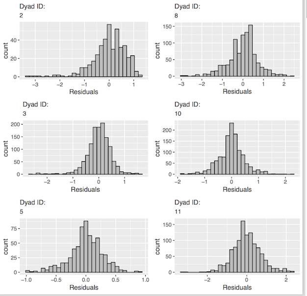
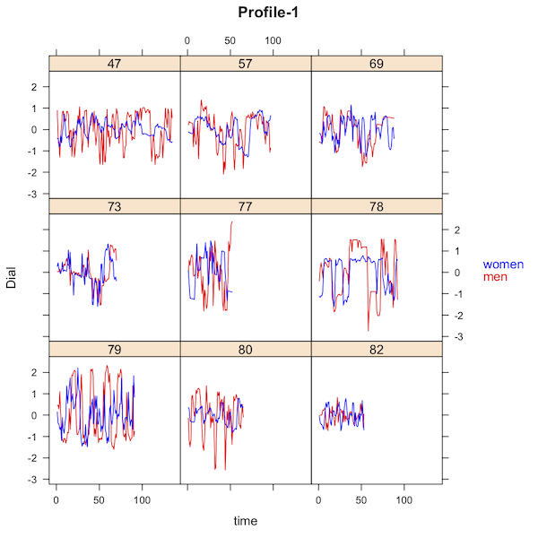
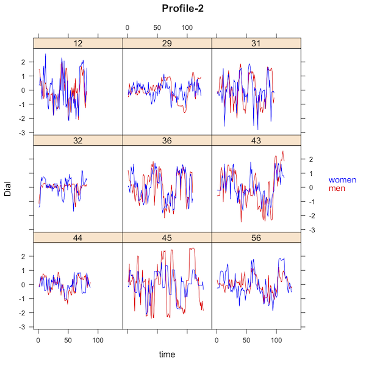
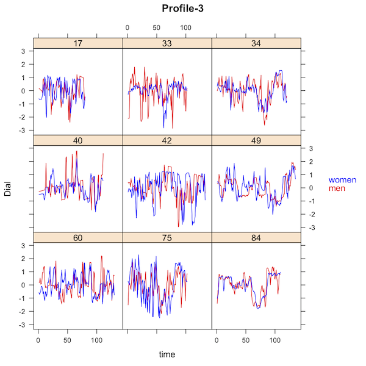

```{r setup, include = FALSE}
knitr::opts_chunk$set(
  collapse = TRUE,
  comment = "#>"
)
```

As for all _rties_ analyses, the first step for an Inertia-Coordination analysis is to follow the instructions in “overview_data_prep” to visualize and prepare the data. We include only the minimal required steps here:

```{r}
library(rties)
data1 <- rties_ExampleDataFull
```

The Inertia-Coordination model represents the within-person pattern of inertia, which is defined as the extent to which a person’s state can be predicted from his or her own state at a prior time point (a.k.a. auto-regression), and the between-person pattern of coordination, which is defined as the extent to which one partner’s state can be predicted from their partner’s state either concurrently or time-lagged (Reed, Randall, Post, & Butler, 2013). Specifically, the time-series state variable is predicted by: 1) separate intercepts for each partner, 2) a person’s own state variable at a prior time point, which gives two “inertia” estimates, one for each partner, and 3) the person’s partner’s state variable at the same prior time point, which gives two “coordination” estimates, again one for each partner. This model is identical to the "Stability-Influence" model (Thorson, West & Mendes, 2017), but we prefer the terms "inertia" and "coordination" rather than "stability" and "influence" because they have fewer connotations that may or may not be appropriate for a given research design. The lm model used by the _rties_ functions is:    

lm(obs_deTrend ~ -1 + dist0 + dist1 + dist0:obs_deTrend_Lag + dist0:p_obs_deTrend_Lag + dist1:obs_deTrend_Lag + dist1:p_obs_deTrend_Lag, na.action=na.exclude, data=datai)

where “obs_deTrend” is the observed state variable with individual linear trends removed (e.g., it is the residuals from each person’s state variable predicted from time). The “-1” , “dist0” and “dist1” work together to implement a two-intercept model, whereby the overall intercept is omitted and instead separate intercepts are estimated for the level-0 and level-1 of the distinguisher variable provided by the user (for a discussion of this approach see: Kenny, Kashy, & Cook, 2006). The terms “dist0:obs_deTrend_Lag” and “dist1:obs_deTrend_Lag” estimate the inertia parameters for the partners scored 0 and 1 respectively on the distinguishing variable (e.g., “obs_deTrend_Lag” is the person’s own de-trended observed state variable lagged by how ever many steps the user specifies). Similarly, “dist0:p_obs_deTrend_Lag” and “dist1:p_obs_deTrend_Lag” estimate the coordination parameters for the partners scored 0 and 1 respectively on the distinguishing variable (e.g., “p_obs_deTrend_Lag” is the person’s partner's de-trended observed state variable lagged by how ever many steps the user specifies). The model is estimated separately for each dyad (e.g., “datai” is the data from couple “i”).     

If we consider the parameters of the model in isolation from each other, positive inertia estimates imply slower fluctuations of the state variable, while negative inertia estimates imply that the observed variable is oscillating back and forth between each lag (see Figures in overview_data_prep). For the between-person coordination parameters, a positive estimate implies an in-phase pattern, such that when one partner is high on the observed state variable, so is their partner at the specified lag, while a negative parameter implies an anti-phase pattern, such that when one partner is high the other partner is low at the specified lag (Randall, Post, Reed, & Butler, 2013; Reed et al., 2013; Wilson et al., 2018). It is important to realize, however, that the parameters do not act in isolation - they work together as a set to determine potentially complex trajectories for both partners over time. As with any non-linear model, it is impossible to inspect the inertia and coordination parameters and draw any conclusions about the dynamic pattern implied without actually plotting it using the full set of parameter estimates. The _rties_ package provides a variety of functions for doing so that are described below.

### Sample Size Considerations

There are two sample size considerations for any of the models implemented in _rties_. The first pertains to the number of observations per dyad that are required, while the second is the number of dyads required. The first consideration comes into play when we estimate the dynamics one dyad at a time. Greater complexity requires finer-grained measurement of time and hence more observations per dyad. One advantage of the Inertia-Coordination model is that it is fairly simple and hence requires relatively few observations per dyad. The exact number will depend on how much variance there is over time, both within-people and between-partners, but it is likely to provide good results with as few as 10 observations per dyad (someone should do a simulation study of this!).     
The second sample size consideration comes into play when we use latent profiles based on the estimated dynamic parameters for each dyad to either predict the system variable, or be predicted by it (these steps are described in detail in sections below). In both cases, the system variable can be either a dyadic variable (e.g., both partners have the same score, as in relationship length) or an individual variable (e.g., partners can have different scores, as in age). In the case of predicting a dyadic system variable, a regular regression model is appropriate for normally distributed system variables, or a generalized linear model for non-normal ones (any of the families available for glm can be used). In this case, the shared system variable is predicted by the categorical latent profile membership and you can use your favorite rule of thumb along the lines of “n observations for a one-predictor regression model” to choose your sample size. Alternately, you could conduct a power analysis for the linear (e.g., regular regression) or generalized linear model you choose. 

The situation is more complicated when the system variable is assessed at the individual level, or when it is the predictor of the latent profiles. In the former case, the system variable is predicted using a cross-sectional random-intercept dyadic model with the latent profile membership, the distinguisher variable and their interaction as fixed effects. For these models, it should be possible to use the R package _simr_ to estimate the necessary sample size to obtain desired power. In the latter case, profile membership is predicted using either a binomial (for 2 latent profiles) or multinomial (for more than 2 latent profiles) model, with either just the system variable as a predictor (for dyadic system variables), or each partner's system variable and their interaction as predictors (for individual system variables). For these models, it should be possible to use G-Power, or some other software for logistic and multinomial regression, to assess the needed sample size for a given power level.

### Choosing the Lag Length

One complexity in using the Inertia-Coordination model is that the results are highly dependent upon the chosen lag length (for discussion of a similar issue when choosing the measurement interval see Boker & Nesselroade, 2002). This dependence on the lag makes interpretation problematic unless one has a strong theory about the temporal processes at work. At a minimum, it is a good idea to inspect the auto-correlation (relevant to inertia) and cross-correlation (relevant to coordination) plots for the observed state variables. If the state variables are oscillating at all, the auto- and cross- correlations will also oscillate depending on lag. For example, the correlations can vary from negative, to zero, to positive depending on the lag. To facilitate making an informed decision about lag length, _rties_ provides functions to produce auto- and cross- correlation plots. Here we plot a chosen subset of dyads to show the strong impact that is sometimes found due to lag, especially for cross-correlation. 

```{r, fig.height=5, fig.width=5}
temp <- subset(data1, couple %in% c(2,5,27,31,47,60,103,110))
autoCorPlots(basedata=temp, dyadId="couple", personId="person", obs_name="dial", time_name="time")
crossCorPlots(basedata=temp, dyadId="couple", personId="person", obs_name="dial", time_name= "time")
```

In addition to visual inspection of the auto- and cross- correlations, choosing the lag relies on a combination of theory, prior research, and how quickly you expect the phenomenon of interest to be changing (see Thorson, West & Mendes, 2017, for additional discussion). For example, if the process is fairly stable, auto-correlation will be high across a long lag time and will dominate any results, because when estimated with the Inertia-Coordination model, the stronger the autocorrelation is, the weaker the cross-correlation will be. This results from the behavior of multiple regression models, where the coordination parameters can only account for independent variance in the outcome after accounting for inertia. Thus part of the decision depends upon how much of the observed state variables behavior you want to be explained by within-person auto-correlation processes versus how much you prefer to prioritize between-person cross-correlations. Another consideration is how many observation time points there were. For each lag you lose one observation point (e.g., if the lag is two steps, then the parameter estimates will be based on the total number of observations per dyad minus 2). One strength of _rties_ is that it makes it very easy to alter the lag length and observe the impact on the results, which is helpful for developing an intuitive understanding of inertia and coordination.

Another approach provided for the lag is the "absMaxCC" option. If this is chosen for setting the lag, then the absolute maximum cross-correlation is found for each dyad and the lag at which that occurs is used to lag their data. This approach gives priority to between-partner interdependencies in the data, which may be justified when the research focus is on that component of the system rather than the within-person autocorrelation.

### Assessing Model Fit

Having chosen a lag length (here we use the maximum cross-correlation), we complete the data preparation with the "dataPrep" function.
```{r}
data2 <- dataPrep(basedata=data1, dyadId="couple", personId="person", obs_name="dial", dist_name="female",
                  time_name="time", time_lag="absMaxCC") 
```

The next step, which is often neglected in the literature, is to assess how well different variants of the Inertia-Coordination model fit the observed temporal data. Our ultimate goal is to either predict outcomes of interest from the dynamics assessed by the model, or to test whether other variables predict those dynamics. Either way, the results are only meaningful if the Inertia-Coordination model does, in fact, realistically represent the dynamics of the system. We therefore provide a function, "indivInertCoordCompare"", that fits three versions of the model (inertia-only, coordination-only, inertia and coordination) to each dyad's data and returns a list that includes: 1) the adjusted R^2 for each dyad for each of the 3 models (“R2inert”, “R2coord” and “R2inertCoord” e.g., how well each model predicts the observed temporal trajectories of the data), and 2) differences between the R2 for each model, where "R2dif_I_C" is the R2 for the inertia-only model minus the coordination-only model, "R2dif_IC_I" (inertia-coordination minus inertia), and "R2dif_IC_C" (inertia-coordination minus coordination-only). The function takes the name of the processed dataframe, here "data2", and the results can be accessed with the "summary"" function: 

```{r}
compare <- indivInertCoordCompare(data2)
summary(compare$R2inert)
summary(compare$R2coord)
summary(compare$R2inertCoord)
summary(compare$R2dif_IC_I)
```
In this example, we see that the full model accounts on average for about 36% of the variance in the observed state variables, while the inertia-only model accounts for almost as much (31%) and the coordination-only model accounts for only 15% on average and adds only about 5% to the inertia-only model when included in the full model. These results suggest that coordination is not critical for describing the dynamics of the system, over and above inertia. It is still possible, however, that the small amount of variance explained by coordination may predict system variables, such as relationship quality or health, better than the larger amount of variance explained by inertia.    

In addition to the model comparison results, we provide a function, "indivInertCoordPlots"", to plot the observed state variables for each dyad, superimposed with their model predicted trajectories. The function takes as arguments the name of the processed dataframe, which of the 3 variants of the inertia-coordination model to plot the results for ("inert", "coord", "inertCoord"), optional strings providing labels for the level-0 and level-1 of the distinguishing variable, as well as the name of the observed state variable (default is "observed") and minimum/maximum values for the y-axis in terms of quantiles (default is the observed minimum and maximum of the state variable). These plots provide a visual tool for assessing model fit at the individual dyad level. The default is for the plots to appear on the screen, but this is slow. A better approach is to set printPlots=FALSE, asign the plots to an object, use gridExtra to put multiple plots on each page and then save them as a pdf.

```{r, eval=FALSE}
figures <- indivInertCoordPlots(data2, "inertCoord", dist0name="Men", dist1name="Women", plot_obs_name="Dial", minMax=c(.05,.95), printPlots=F)
modelPlots <- gridExtra::marrangeGrob(grobs= figures, ncol=2, nrow=3)
ggsave(filename="modelPlots.pdf", plot=modelPlots, device="pdf")
```

The following figures show examples of poor and good fit respectively:
  

Finally, we provide a function that plots the residuals from fitting the model to each dyad. As with any regression model, a good fit is indicated by normally distributed residuals with a mean of zero and suggests that the model assumptions have been met. In our use case, it provides evidence that the state variables are normally distributed enough to be appropriate for this model. Again, the default is for the plots to appear on the screen, but a better approach is to combine and then save them as a pdf. Here we show a few examples of such plots.
```{r, eval=FALSE}
residPlots <- inertCoordResids(prepData=data2, whichModel="inertCoord", printPlots=F)
residPlots <- suppressMessages(gridExtra::marrangeGrob(grobs= residPlots, ncol=2, nrow=3))
ggsave(filename="residPlots.pdf", plot=residPlots, device="pdf")
```
  

### Generating Dynamic Parameter Estimates

The next step is to use the function “indivInertCoord” to generate the dynamic parameter estimates for each dyad. The function takes the name of the processed dataframe ("data2" in this example) and the name of the version of the Inertia-Coordination model that you want the parameter estimates for ("inert", "coord", or "inertCoord"). It returns a dataframe containing the parameter estimates, called "params", for use in the latent profile analysis (see below). In the returned dataframe, "int0" and "int1" are the estimated intercepts for the partner scored 0 amd 1 on the distinguisher respectively (e.g., their estimated state variable at time zero). The variables "inert0" and "inert1" are the inertia estimates for each partner and "coord0" and "coord1" are their coordination estimates. 
```{r}
ic <- indivInertCoord(prepData=data2, whichModel="inertCoord")
head(ic$params)
```

### Latent Profile Analysis (LPA)

The next step is to use the parameter estimates generated by “indivInertCoord” as input to a latent profile analysis. Because the models in _rties_ all represent non-linear dynamics, the behavior of the dyadic system cannot be intuited by examining individual parameter estimates from the model. Rather, they operate together as a set to produce potentially complex temporal trajectories of both partner's state variables (emotional experience in this example). Thus when it comes to using the dynamic parameter estimates to predict, or be predicted by, system variables such as conversation quality, we wish the parameters to be operating as a set, not as isolated individual predictors or outcomes such as would be the case if we used them as predictors in a regression model. Instead, we use them as input to a latent profile analysis in order to estimate qualitatively distinct groups of dyads based on the dynamics assessed by the Inertia-Coordination model. In other words, we wish to group the dyads based on their similarities and differences in terms of patterns of inertia and coordination. 

The latent profile analysis makes use of the _mclust_ package (Scrucca L., Fop M., Murphy T. B. and Raftery A. E., 2016). Specifically, the _rties_ function "inspectProfiles" provides a wrapper to some of the functionality provided by _mclust_. LPA is a form of Gaussian Mixture Model, which assumes an underlying multivariate normal distribution and groups cases based on a set of observed variables (in our case the Inertia-Coordination parameter estimates for each dyad). In much of the literature on LPA the focus is on trying to estimate the "true" number of underlying profiles by using fit statistics such as the BIC, but simulation studies tend to show that this process doesn't work very well unless you have a huge sample and large effect size (see for example Tein, Coxe & Cham, 2013). Thus, in the context of _rties_ we completely ignore fit statistics and suggest choosing the number of profiles based on: 1) interpretability in terms of meaningful dynamics, 2) the number of cases assigned to each profile, and 3) how well separated the profiles are. The "inspectProfiles" function provides results relevant to each of the these criteria, which we discuss below. We suggest considering results for 2, 3 and 4 profiles. More than that is unlikely to be interpretable, unless you have a theory that suggests 5 or more distinct dynamic patterns. Note that _mclust_ automatically considers a set of different models, given the number of profiles, that differ based on how the variances and covariances of the input variables are handled (e.g., fixed, varying, zero). The results that are returned are for the best-fitting of those models based on the BIC. As an example, the following syntax runs the "inspectProfiles" function for 3 profiles and returns the profile membership scores in a dataframe for subsequent analyses. It also produces a frequency table and a number of plots, which we discuss below. 
```{r, warning=F, fig.width=4.5}
lpaData <- inspectProfiles(whichModel="inertCoord", prepData=data2, paramEst=ic$params, n_profiles=3, seed=21, numPlots=1)
```

In choosing the number of profiles, we first consider the number of dyads included in each profile and prefer solutions where there are at least about 10% of the dyads in the smallest profile. The rationale here is that we do not want a solution that is driven by a very small portion of our data, since that is unlikely to be a robust finding. In this example, the first part of the output (before the plots) is a frequency table which shows that there are 23 dyads in Profile 1, 16 in Profile 2 and 13 in Profile 3, which is a relatively balanced set of sample sizes. 

Next we consider the first plot above showing the projection of the data onto the clustering solution. We prefer solutions where the profiles are clearly separated. In this example, we see clear separation, with each color of dot fully separated from the others. The second plot shows the means for each parameter for each profile. 

Finally, and most importantly, we consider how meaningful the dynamics of each profile are, which can be established by inspecting the model predicted trajectories of the state variable for each profile. If plotted directly, the Inertia-Coordination model predicts simple exponential growth or decline, which by itself would not be a good representation of most interpersonal temporal data. For example, the time-series emotional data in our example clearly do not show simple exponential growth/decline, but rather fluctuate up and down over time. The model only becomes a good representation of our data when random noise is added at each temporal step. In other words, local exponential growth/decline becomes a fluctuating trajectory when the system is randomly perturbed at each time step.

In order to visualize the model predicted dynamics, therefore, we provide 3 exemplar plots for each profile, based on the Inertia-Coordination parameter estimates for that profile in combination with random noise at each time step. If you want reproducible results, however, you can use the "seed" argument to set the random seed for the plots, in which case just one example per profile is provided (see the plots above). We prefer solutions where it can be seen with the naked-eye that there are distinct dynamics characterizing the profiles. In this example, the dynamics of Profiles 2 and 3 are not as clearly separated as would be ideal, but we can see that Profile 1 is characterized by quite flat anti-phase oscillations, while Profile 2 and 3 show much larger amplitude oscillations that are more anti-phase for Profile 2 and in-phase for Profile 3.

Due to the importance of the plots for deciding the number of profiles, we also provide a stand-alone function, "inertCoordPlotTraj" that produces the same type of plots as "inspectProfiles", but with more optional arguments for controlling the presentation. The following syntax provides an example. The three most useful arguments are "minMax," which allows you to scale the y-axis by setting the minimum and maximum values based on quantiles (in this example, we set them to the 3rd and 93rd percentiles of the observed state variable), "time_length" which sets the x-axis to however many time steps you would like, and "numPlots" which sets the number of exemplar plots to produce. If you want reproducible results, you can again use the "seed" argument and set the number of plots to one. By plotting over the longer time length, the distinction between Profiles 2 and 3 becomes more apparent.
```{r, fig.width=4}
plots <- inertCoordPlotTraj(prepData=data2, paramEst=ic$params, n_profiles=3, dist0name = "w", dist1name = "m", plot_obs_name = "EE", time_length=100, minMax = c(.025,.975), seed=6, numPlots=1)
```

Once you have decided on the number of profiles you would like to use, you should re-run "inspectProfiles" with that number set. It will return a dataframe (called "lpaData"" in this example) that includes the profile membership scores to be used as a predictor or outcome of any system variables of interest. The function "makeFullData" then combines the profile membership data with your original dataframe containing the system variables you would like to explore as predictors and outcomes of the profile membership.
```{r}
fullData <- makeFullData(basedata=data1, dyadId="couple", personId="person", dist_name="female", 
                         lpaData=lpaData, params=ic$params)
head(fullData)
```

Finally, if the number of profiles you have chosen provides a good representation of the data, you should be able to at least fantasize that you can see the prototypical trajectories reflected in the raw data. Of course, the raw data has a lot of noise which makes it hard to see patterns, but a good LPA solution should produce groups of dyads that appear to at least have some similarity to each other and to the prototypical trajectories. In order to assess this, we provide the function "plotDataByProfile" that produces plots of the raw data grouped by profile membership. You can either have the plots displayed on the screen, or save them as a pdf.
```{r, eval=FALSE}
# display plots on screen
profilePlots <- plotDataByProfile(prepData=data2, fullData=fullData, n_profiles= 3, dist0name="men", dist1name="women", plot_obs_name="Dial", printPlots=T)
# save plots to pdf
pdf("dataByProfile.pdf")
plotDataByProfile(prepData=data2, fullData=fullData, n_profiles= 2, dist0name="men", dist1name="women", plot_obs_name="Dial")
dev.off()
```
Here we show a few examples from each profile. Here Profile 1 does not show the flat trajectory predicted, and may be better characterized by the men oscillating faster and with larger spikes than the women. Profiles 2 & 3, however, do show some suggestion of the anti- versus in- phase trajectories predicted by the model.
 

### Next Steps and a Warning

At this point you have a dataframe containing the original data, combined with profile membership for each dyad. You also have a dataframe with the intertia-coordination parameter estimates for each dyad. One option is to use the built-in capability of _rties_ for using profile memberships to either predict, or be predicted by, the system variable (see vignette called "sysVar_inOut"). Another option is to do whatever further analyses you want outside the _rties_ environment. But please, if you use the parameter estimates in subsequent analyses, do not investigate one (or several) in isolation! THe predicted dynamics depend on all of the parameters operating together as a set. For example, it is an error to take one parameter, for example the male's coordination parameter, and correlate it with something else. You could have two dyads, both of which have the male coordination parameter estimated to be .45, but those dyads could still have completely different dynamics (e.g., could end up in different profiles), depending on the values of all the other parameters. So, whatever you do, keep the parameters operating together as a set or be warned that any findings are uninterpretable.


