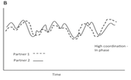

```{r setup, include = FALSE}
  knitr::opts_chunk$set(
  collapse = TRUE,
  comment = "#>"
)
```

The _rties_ package was designed to explore interpersonal dynamics and their correlates. More specifically, it provides tools to explore whether a set of bivariate temporal patterns either predict, or are predicted by, global variables of interest. Although we focus on time-series data from both people in dyads, the models are appropriate for any bivariate normal time-series data (e.g., heart rate and skin conductance from one person over time).

The analysis starts with an observed variable, assessed repeatedly over time for both partners in a sample of dyads. We provide a set of models that represent different aspects of the bivariate dynamics of the partners' observed variables. The parameter estimates from those models are then used as input variables for a latent profile analysis and the profile membership for each dyad is used either to predict, or be predicted by, cross-sectional variables of interest (e.g., each person’s self-reported health).

Currently the package includes two models: 1) the “Inertia-Coordination” model, which can represent within-person inertia and between-person in-phase or anti-phase coordination (Figure 1), and 2) a “Coupled-Oscillator” model, which can represent between-person damping and amplification of coupled oscillations (Figure 2).
```
Figure 1: Patterns represented by the Inertia-Coordination model. The bivariate time-series variable is on the y-axis. Panel A shows low and high inertia. Panel B shows in-phase coordination. Panel C shows anti-phase coordination.
```
  
```
Figure 2: Patterns represented by the Coupled-Oscillator model. The bivariate time-series variable is on the y-axis. Panel A shows between-person damping of oscillations. Panel B shows between-person amplification of oscillations.
```
  

## General Procedure

The first step is to choose the observed variables, which must be two normally distributed time-series that come from the same system (e.g., same dyad or same person). In the language of dynamic systems, the pair of observed responses are indicative of the underlying (latent) states of the system across time. In _rties_ we refer to the two time-series of observed responses as the “state” variables, and attempt to represent their dynamics with a mathematical model. The temporal unit of observation (e.g., seconds, minutes, days), minimum number of observations per dyad and minimum number of dyads required for these analyses depend on theory about the process of interest, in combination with the model chosen. More information is given in the documentation for each model.   

The second step is to choose which of the models include parameters representing relevant aspects of the system you are interested in. For example, imagine a very simple model that has only intercepts and linear slopes for each partner (e.g., we theorize that the system can be characterized by two independent lines, which is clearly over-simplified and not “interpersonal” at all, but useful for understanding our general approach). We then estimate the parameters for that model separately for each dyad. In our example, we would use our data to estimate the 4 parameters of the model (2 intercepts and 2 slopes) for each dyad.  

In the third step we use the set of parameter estimates (e.g., each dyad’s intercept and slope estimates) as input variables for a latent profile analysis, making use of the _mclust_ package (Scrucca L., Fop M., Murphy T. B. and Raftery A. E., 2016). In the fourth and final step, the resulting profile memberships are then used either as predictors, or outcomes, of some variable of interest across all dyads. We refer to these global variables as “system” variables because they are theoretically related to the system being studied, but change slower than the state variables used to assess the dynamics of the system (for examples of other research groups using similar approaches see: Felmlee, 2007; Ferrer, Chen, Chow, & Hsieh, 2010; Ferrer & Steele, 2014; Hollenstein, 2013; Krone et al, 2018; Steele, Ferrer, & Nesselroade, 2014; Steenbeek & van Geert, 2005). The system variable can be assessed at either the dyad level (e.g., both partners have the same score, such as relationship length) or the individual level (e.g., the partners can have different scores, as in a personality measure).

## Getting Started and Required Data Format

To get started, install _rties_ from CRAN or GitHub (for the developer's version) and load it in R. It may require you to install or update additional packages. Occasionally, this step causes problems because one or more of those packages won't install. Often, _rties_ will still work if you just skip those installations/updates.

```{r, eval=F}
install.packages("rties")
```
```{r}
library(rties)
```

The _rties_ package includes functions to do all the data processing necessary for any of the models, but you must provide it with a dataframe that meets a number of criteria. The example dataframe called "demo" shows the necessary format. It only contains data for 2 dyads with just 3 time points, which is not enough for any of the _rties_ models, but makes it easy to see the needed data structure. Here we assign the demo data to a dataframe and view its contents.
```{r}
demoData <- rties_ExampleData_Demo
head(demoData, 12)
```

The dataframe must include: 1) a numeric couple-level ID (called "couple" in the example), 2) a numeric person-level ID (called "person" in the example; see below for additional important information about this variable), 3) a numeric, fairly normally-distributed time-varying observable (the state variable) assessed for both partners, which in this example is the emotional experience of romantic partners, self-reported in 2 second units using a rating dial following a conversation, while watching the video of their conversation as a memory prompt (called "dial"), 4) a numeric variable that starts at 1 and goes in 1-unit steps indicating the temporal sequence of the observations (called "time" in the example; must be in the form 1,2,3,etc), and 5) a numeric variable that distinguishes the partners (e.g., sex, mother/daughter, etc) and is scored 0/1 (called "female" in the example). If the dyads in your sample are not distinguishable, you can still use _rties_, but will need to make some modifications to the data that are described below.

In order to connect the dynamics of the state variables to one or more system variables (e.g., time-constant things to predict, or be predicted by, the dynamics) you will also need to provide at least one cross-sectional system variable. It can be measured at either the individual or the dyad level. In the demoData, we included "empathy," which is an individual-level self report of trying to empathize with one's partner during the conversation. The system variable(s) can be numeric or categorical (e.g., a factor with any number of levels) for predicting the dynamics, but must be numeric (binary is ok) for being predicted by them.

__Important__: Note that the data is in "long" format, with time stacked within individuals stacked within dyads. Each dyad  can have it's own unique number of observations, but the partners within each dyad must have the same number of observations (e.g. rows of data), although those can include rows that have missing values (NAs). In addition, for the level-1 partner (e.g., the partner who is scored 1 on the distinguishing variable), the dyad ID and person ID must be the same. Then you must choose a large number to add to the level-1 person ID to get the level-0 person ID. For example, if you have 200 couples, you might choose 500 as the value to add. Then, if the dyad IDs and person IDs for the level-1 partners in the first 4 dyads were 1, 3, 4, 7 the level-0 partners would be 501, 503, 504, 507 (see demo data for what this should look like). Some functions will need the number you added as an argument called “idConvention”. 

The following syntax provides an example of how to create an appropriate person ID variable, so long as you have fewer than 500 couples; if you have more, you need to add a bigger number. The variable "female" is the 0/1 distinguishing variable. If you have indistinguishable dyads, you will need to start by creating an arbitrary distinguisher where one partner in each dyad is scored 0 and the other is scored 1 and use that variable in the following code instead of "female".
```{r, eval=FALSE}
demoData$person <- ifelse(demoData$female == 1, demoData$couple, demoData$couple + 500 )
```

__How to handle bivariate data within-person__: If you have data from two variables assessed over time within-person (e.g., heart rate and skin conductance measured over time for a sample of people), rather than the same variable assessed over time from both partners in dyads, you can still use _rties_, but you need to mimic the required data structure. Instead of having people nested in dyads, you would have variables nested within person. Thus the couple ID is now a person ID, the person ID is now a variable ID (and you must follow the ID convention above), and the distinguishing variable indicates which variable is which, rather than which person is which. Everything else remains the same.

__How to handle indistinguishable dyads__: As described above, one approach is to use an arbitrary distinguisher, where one partner in each dyad is randomly assigned to be 0 and the other to be 1. In that case, you should not pay any attention to any output or results related to the distinguisher; it is simply there to keep the data in order by person and is otherwise meaningless. An alternate approach is to create a distinguisher using some substantive variable that you have theoretical grounds to think may play a role in your system. For example, if you think that differences in empathy between partners may impact the dynamics, and you have a person-level measure of empathy in the relationship, you would assign the partner scoring lower on empathy in a given dyad a 0 and the partner scoring higher on empathy in that dyad would be scored a 1. The following function creates such a 0/1 distinguishing variable and adds it to "demoData" based on person-level scores on the measure of empathy. Note that continuous variables will work best for this purpose, because if partner's have identical scores on the variable (e.g., identical "empathy" scores in this example), then they will end up with missing values on the 0/1 distinguisher and will be effectively dropped from the rest of the analysis. 
```{r, eval=FALSE}
demoData <- makeDist(basedata=demoData, dyadId="couple", personId="person", time_name="time", dist_name="empathy")
```

Once you have your data in an appropriate format, we recommend saving it as a .csv file because that is the easiest way to read it into R, as shown in following syntax. Note the path and file name are specific to where the data is saved on my computer and you would need to replace that with the relevant path for your file and computer.
```{r, eval=FALSE}
demo <- read.csv("/Users/emily/Documents/Projects/R-TIES/Data/demo.csv")
```

## Data Visualization and Preparation

For this vignette, we will work with an example data set provided with _rties_, so we start by assigning the example data to a dataframe and listing its contents. The central variables are the same as described above for the demo dataframe, but we now have real data from a sample of couples and a set of 9 possible system variables (reltime through dyadInfluence).
```{r}
data1 <- rties_ExampleDataFull
str(data1)
```

Dynamic models are complex and there are a lot of ways to fool yourself about the quality and interpretation of the results. To help prevent this, we strongly advocate looking at your data and results at every step of the analysis and we provide visualization tools to make it easy. As an initial check, we recommend looking at histograms of all of the numeric variables in your dataframe. This should uncover any seriously ill-behaved data (extreme outliers, zero variance, etc) and establish whether the intended state variable (e.g., "dial" in the example) is at least somewhat normally distributed. It does not have to be perfect, but it should be at least somewhat continuous and not be horrendously skewed or multi-modal. If it is not somewhat normal, you should try transforming it and if that doesn't work, you will need a different variable. In the example, "dial" is clearly not perfectly normally distributed, but is an example of good-enough, which we established by looking at plots of residuals when the dynamic models were fit to the data for each dyad (see details in the vignettes for each model). In addition, for any system variables you intend to use as outcomes of the dynamics, you will need to decide whether they are fairly normally distributed (in which case the _rties_ defaults will be appropriate), or whether you will need to use one of the generalized linear model options (see details in the vignettes for each model), or perhaps transform it. The following function produces histograms for all numeric variables in a dataframe. Here we just plot a subset of the variables to save space:

```{r, fig.width=5, fig.height=5}
temp1 <- subset(data1, select=c(reltime:conflict))
histAll(temp1)
```

A second highly recommended check is to plot the raw time-series data for each dyad, which can be accomplished with the “plotRaw” function. If you have a large number of dyads, you may want to only plot a random subset, or several random subsets. For this vignette we plot a specific sub-set to present some typical-looking examples. By default, the function prints the plots to the screen, but this can be turned off using printPlots=FALSE. Use ?plotRaw for further explanation of the arguments for the function. 
```{r, dpi=180}
temp2 <- subset(data1, couple %in% c(2,3,5,8,10,12,13,17,19))
plotRaw(basedata=temp2, dyad="couple", obs_name="dial", dist_name="female", time_name="time", dist0name="Men", dist1name= "Women", plot_obs_name="Dial")
```

You can also save the plots to an object and/or print them as a pdf:
```{r, eval=FALSE}
# save them as a list
plots <- plotRaw(basedata=temp2, dyad="couple", obs_name="dial", dist_name="female", time_name="time", dist0name="Men", dist1name= "Women", plot_obs_name="Dial", printPlots=F)

# print them as a pdf
pdf("rawPlots.pdf")
plotRaw(basedata=temp2, dyad="couple", obs_name="dial", dist_name="female", time_name="time", dist0name="Men", dist1name= "Women", plot_obs_name="Dial")
dev.off()
```

In this example, we see that one person is completely missing data for dyad 19, which will cause problems if we don't fix it. If you are not plotting all your dyads, you will need to use some other method to identify any dyads with completely missing data for one or both partners. This visualization is also useful for spotting outliers, noise in the data, etc. that should be fixed before proceeding.
At this point, it would be worthwhile to see if the missing data can be accounted for. In our case, we discovered there had been recording problems for the one person and so the only thing we can do about the missing data for dyad 19 is to remove that dyad from the analysis (several steps in the modeling require at least partial data from both partners and will generate error messages if that is violated). The following syntax accomplishes that. First, the dyad to remove is assigned to an object called "dyads" (if more than one dyad is to be removed, this could be a vector, e.g., dyads <- c(3, 5, 19) would remove three dyads). Then the "removeDyads" function takes as arguments the full dataframe, the variable indicating which dyads to remove, and the name of the dataframe column that includes dyad membership.
```{r}
dyads <- c(19)
data1 <- removeDyads(basedata=data1, dyads=dyads, dyadId="couple")
```

The “dataPrep” function does much of the work of processing the data into a generic form that is appropriate for any of the _rties_ models (see syntax below). In this example, “data1” is the original data set with any necessary cleaning done and “data2” will be a dataframe holding the processed data. The argument called "time_lag" is optional and specifies the number of steps to lag variables for the Inertia-Coordination model (see comments below). Use ?dataPrep for further explanation of the arguments for the function. 
```{r}
data2 <- dataPrep(basedata=data1, dyadId="couple", personId="person", obs_name="dial", dist_name="female", time_name="time", time_lag=5) 
str(data2)
```

The function returns a dataframe that has all the variables needed for the next stage of _rties_ modeling, each renamed to a generic variable name, which are:   

* dyad = dyad id
* id = person id
* obs = observed state variable
* dist1 = 0/1 variable where the 1's indicate the 1's in the original distinguishing variable
* dist0 = 0/1 variable where the 1's indicate the 0's in the original distinguishing variable
* time = the variable indicating temporal sequence
* obs_deTrend = the observed state variable with each person's linear trend removed
* obs_deTrend_Lag = the lagged version of the obs_deTrend variable
* p_ = all the same variables, but for a person's partner rather than themselves    

__A note about choosing the lag__: First, it is only relevant for the Inertia-Coordination model and you should not use this argument for the Coupled-Oscillator model. When using the Inertia-Coordination model, however, it requires lagging by some number of steps to be meaningful and the decision about how many steps to lag should be driven by theory, prior research or mindful exploration. In our example, emotional experience was assessed in 2 second intervals and so a 1-step lag is very small and doesn't leave time for meaningful change between observations. We chose a lag of 5 steps, which is equivalent to 10 seconds, because 10 seconds is a common unit to aggregate over in the emotional experience literature and if emotions unfold over several minutes (as suggested by many theories), then 10 second steps are large enough to allow meaningful change between each step, but small enough to not miss important changes. Another approach that is provided is to use the "absMaxCC" option for time_lag. In that case, the maximum absolute value cross-correlation is found for each dyad and the lag at which that occurs is used to lag their data. This method prioritizes the between-partner interdependencies in the data and may be reasonable if the research focus is on that aspect of the system, rather than the within-person autocorrelation. 

At this point you are ready to begin using one or more of the models to test whether any of the dynamic patterns can predict, or be predicted by, your system variable(s) of interest. The procedures for each model are documented in additional vignettes.